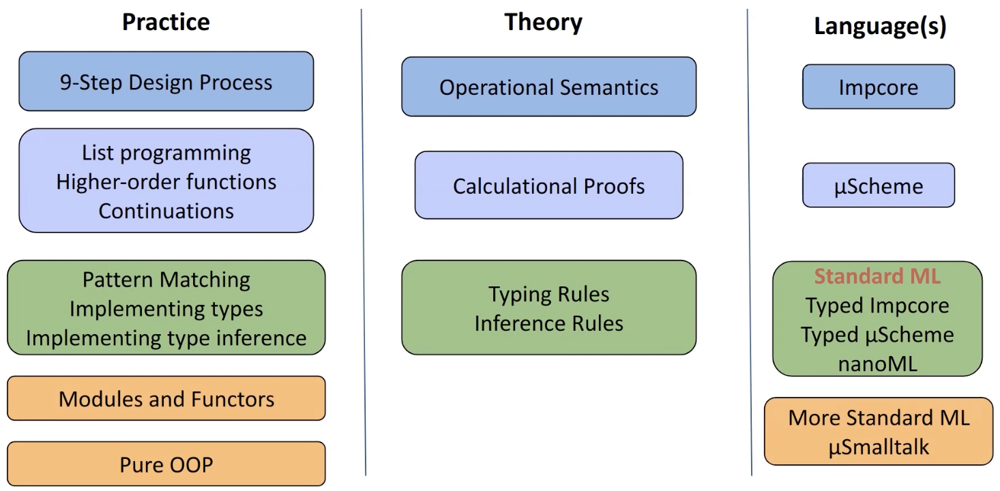
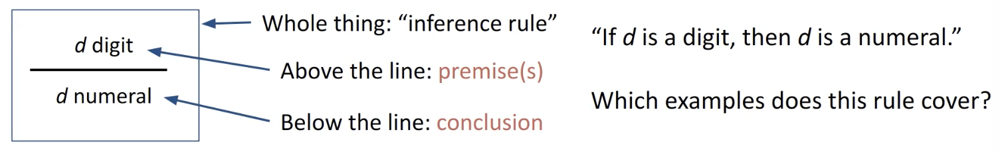
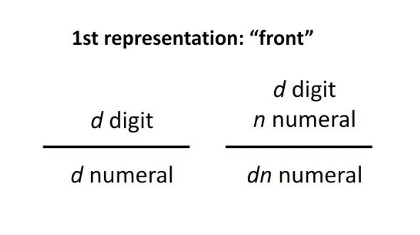
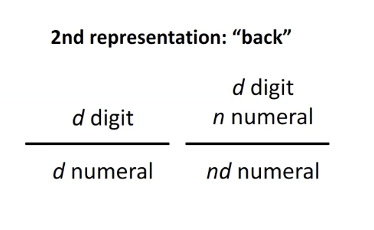

# Intro

## 105: The Big Picture

### What we learn

- There are a bajilion PLs, more than we could possibly list
- 105 focuses on reusable principles and features that exist across languages
- We also spend lots of time talking about PL theory, then implement that theory in practice

### What we do

- Write lots of tiny programs
- Extend language implementations
- Learn tools to describe languages precisely

### Roadmap



## Course Logistics

### A typical week in 105

- Come to lecture and take notes on Monday and Wednesday
- Attend recitation on Thursday or Friday
  - Probably a good idea to read the homework spec before attending recitation
  - Actually it might be a good idea to start the homework before recitation
- Homework is released on Wednesday morning and is (usually) due on Tuesday at midnight

### Homework timeline

1. Spec is released
2. Do the reading
3. Answer the CQs
4. Programming and proofs
5. Submit everythign using `submit105`
6. Check email after submission to make sure the pdf is viewable.
7. Course staff will upload our stuff to Gradescope later (and it'll look like its late, but don't worry)
8. Stuff gets graded and we read all of our lovely feedback
9. Ask about grades or make a regrade request within 1 week of grades being released via Piazza

### Other

- Use Piazza
- 7 late tokens, up to 1 per assignment
- Don't cheat

## Inductive Definitions of Data

### Defining numerals inductively

- Numerals are a **syntax** for natural numbers
  - We write numbers as a concatenation of digits
  - Examples include: 2, 3, 10000000000000000000000003
  - Non-exampls: -3, 4 + 2, 35.6
- We can represent these numbers with **inference rules**

The structure of an inference rule:



We can use a **recursive** inference rule to cover _all_ numerals. We'll call this first representation the "front" representation.



We could also flip this around and start at the "back".



The choice of representation matters depending on our application. If we want easy access to the low-order digits, we'd use the "back" representation, and vice versa for the high-order digits.

### Defining natural numbers inductively


## A Tour of Impcore

### Lexical structure

- Basic tokens: (optionally signed) numerals (literals) and names (which are anything that is not parnes, semicolons, or Impcore keywords)
- Everything else is very similar to LISP syntax (parenthesized prefix)
  - Ex: `(+ 2 2)`, `(println 4)`, `(if (= 0 0) 0 1)`

### Syntactic structure

1. Expression: something that is evaulated to produce a value (potentially with a side effect)
2. Definition: something that introduces a new thing with a name and a value

### Expression forms

```
exp ::= literal
      | variable-name
      | (if exp exp exp)
      | (function-name { exp })
```

### Definition forms

```
def ::= (val variable-name exp)
      | (define function-name (formals) exp)
```

## Programming with Recursion and Inductive Data
