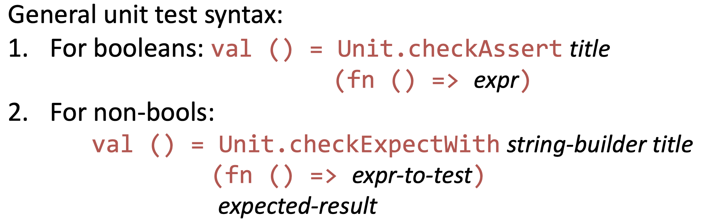

# Functions, lambdas, and HOFs in ML

## Function Syntax

### Definition

The "vanilla" way uses the keyword `fun`. Notice **no parentheces** are required.

```sml
fun add x y = x + y;
(* val add = fn : int -> int -> int *)
```
That type is saying that `add` is a function that takes 2 integers and returns one integer. The number of arrows indicates the number of arguments

### Application

Just say the function's name, followed by the arguments

```sml
add 1 2 + add 3 4;
(* val it = 19 : int *)
```

### Common Errors

What if we added parentheces around the thing (this would be a bad idea but...let's just see)

```sml
add (1 2) + add (3 4);
(* ! Toplevel input:                *
 * ! add (1 2) + add (3 4);         *
 * !      ^                         *
 * ! Type clash: expression of type *
 * ! int                            *
 * ! cannot have type               *
 * ! 'a -> 'b                       *)
```

Hm. Okay, so the interpreter is thinking that the parenthecised bit is calling the function named `1` on the argument `2`. That's obviously wrong.

So the moral:

> Check your parentheces if you see really weird type errors.

What if we try to pass the arguments C++ style?

```sml
add (1, 2) + add (2, 3);
(* ! Toplevel input:                *
 * ! add (1 2) + add (3 4);         *
 * ! ^^^                            *
 * ! Type clash: expression of type *
 * ! int -> int -> int              *
 * ! cannot have type               *
 * ! 'a * 'b -> int -> int          *)
```

### Higher Order Functions

Functions are curried by default! Yay! If we partially call a function we get a function that expects the remaining arguments.

Many HOFs from Scheme are also in ML, but some of them are in the `List` library and others are just in the prelude.

```sml
map (add 1) [1, 2, 3];
(* val it = [2, 3, 4] : int list *)
List.filter (not o null) [[], [1, 2], [], [3, 4]];
(* val it = [[1, 2], [3, 4]] : int list list *)
```

### Lambdas

To get a lambda, omit the `u` in `fun` and use the fun double-arrow `=>` instead of `=`.

```sml
fn x => x + 2;
(*  val it = fn : int -> int *)
(fn x => x + 2) 3;
(* val it = 5 : int *)
```

Lambdas can only take _one_ parameter. But ... that parameter can be a tuple, or we can use nested lambdas.

The nesting version looks like:

```sml
fn x => (fn y => x + y);
(* val it = fn : int -> int -> int *)
(fn x => (fn y => x + y)) 3 5;
(* val it = 8 : int *)
```

With a tuple parameter it would look like:

```sml
fn (x, y) => x + y;
(* val it = fn : int * int -> int *)
(fn (x, y) => x + y) (3, 5);
(* val it = 8 : int *)
```

Okay, so what have we learned about parentheces and lambdas?

> - If you're calling a _nested `fn`_ on arguments, **no parentheces**
> - If you're calling a `fn` with a _tuple_ argument, **yes parentheces**

# Pattern Matching In `val`

We can _name_ parts of a structured value on the RHS, like:

```sml
val (x, (a, _)) = (([1, 2], “hi”), 
                   (24, [(“a”, “b”), 
                         (“c”, “d”)]));
(* val x = ([1, 2], "hi") : int list * string *
 * val a = 24 : int                           *)
```

But this doesn't work when matching against a nonempty list `:(`

```sml
let val (x :: xs) = [1, 2, 3]
in (x, xs)
end;
(* ! Toplevel input:                           *
 * ! let val (x :: xs) = [1, 2, 3]             *
 * !         ^^^^^^^^^                         *
 * ! Error: pattern matching is not exhaustive *)
```

# Functions and Pattern Matching

Remember the laws for `length`? Looks like

```
length []        = 0
length (x :: xs) = 1 + length xs
```

Well we can literally just turn that into a function in ml:

```sml
fun length []        = 0
  | length (x :: xs) = 1 + length xs
```

Let's try with `take`:

```
take [] n              = []
take xs 0              = []
take (x :: xs) (m + 1) = x :: take xs m
```
We can't do arithmatic in the pattern match `:(`, so let's move the form of data over to the rhs for that `int`.

```sml
fun take []        n = []
  | take xs        0 = []
  | take (x :: xs) n = x :: take xs (n - 1)
```
And we can clean that up using `_` for some extra style points

```sml
fun take []        _ = []
  | take _         0 = []
  | take (x :: xs) n = x :: take xs (n - 1)
```

Functions in ml _pattern match_ on their arguments. It is a similar idea to dynamic dispatch in Java, but with even more power because we match on _structure_, not type.

## Review

Consider the general function:

```sml
fun name p11 ... p1n = e1
  | name p21 ... p2n = e2
  | name p31 ... p3n = e3
  .
  .
  .
  | name pm1 ... pmn = em
```

How does call `name arg1 ... argn` get evaluated?
1. Evaluate all the arguments
2.  Try to match the form of the arguments against the first set
of patterns. Match? Evaluate `e1`.
3. No match? Repeat with next set of patterns.
4. Compiler guarantees that _exactly one set_ will match.

## Examples

See [patterns.sml](patterns.sml)

# Exceptions and Unit Tests in ML

## Exceptions

```sml
exception TooShort
fun take 0 _ = []
| take _ [] = raise TooShort
| take n (x :: xs) = x :: take (n - 1) xs

(* Interpreter session *)
- take 3 [1, 2, 3, 4];
> val it = [1, 2, 3] : int list
- take 8 [1, 2, 3, 4];
! Uncaught exception:
! TooShort
```

You could handle an `exception`:

```sml
(* Interpreter session *)
- take 3 [1, 2, 3, 4];
> val it = [1, 2, 3] : int list
- take 8 [1, 2, 3, 4] handle TooShort => [];
> val it = [] : int list
```

## Unit Tests



_string-builder_ is a function that takes the output of _expr-to-test_ from some type `t` and turns it into a `string`. Norman needs this to produce the testing output.

Norman gave us a bunch of builtin _string-builder_ options. Thanks bro. 
