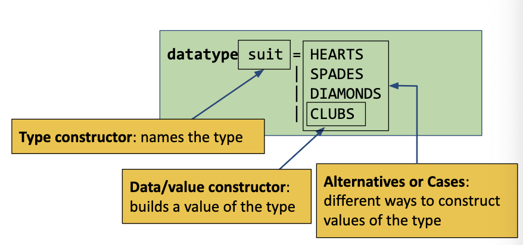

# Review

## An Example:

```sml
fun f (value, [10])         = if value = 10 then true else false
  | f (value, 1 :: 2 :: xs) = let val x = value
                              in x * 2 > 4
                              end
  | f (value, 1 :: 3 :: xs) = (fn v => f (v, xs)) value
  | f (value, _)            = true
```

1. `f` is of type `int * int list -> bool`
2. Which patterns match these input?
```sml
f (8, [10]);     (* pattern 1        *)
f (10, [1, 10]); (* pattern 4        *)
f (10, [1, 3]);  (* pattern 3 then 4 *)
```

3. What to these input evaluate to?
```sml
f (8, [10]);     (* false *)
f (10, [1, 10]); (* true  *)
f (10, [1, 3]);  (* true  *)
```

## Making it look nicer (style)

- Don't use `if-then-else` if the result is a boolean
- Only use local variables to break up a "complex" computation
- Don't use anonymous functions just to pass arguments
- If a part of the pattern is always the same, Do a single top-level pattern for that and use an _internal case expression_ to match on the rest
```sml
fun f (value, xs) =
  case xs of
    [10]         => value = 10
  | 1 :: x :: ys => (case x of 2 => value * 2 > 4
                             | 3 => f (value, ys)
                             | _ => true) (* pattern match must be exhaustive *)
  | _            => true
```

This is a bit much, in the real world we'd probably not use the inner `case` expression. It makes the    expression more complicated than necessary. This is probably better:
```sml
fun f (value, xs) =
  case xs of
    [10]         => value = 10
  | 1 :: 2 :: ys => value * 2 > 4
  | 1 :: 3 :: ys => f (value, ys)
  | _            => true
```

# Intro to Types

## Why Types?

I mean they're not strictly necessary. We can always just fall back on runtime errors. But that is sad and hard. We want the compiler to help us _before_ we run the program!

Types can be thought of as "enforced documentation".

## Programing with Types

A few things we can do with types:

1. Define a type
2. Create a value of a given type
3. Observe/use values of a given type

Define | Create | Use
---|---|---
`int`| `12`, `~5`, arithmatic | arithmatic, comparisons, pat match
`bool` | `true`, `false`, logical ops | logical ops, comparisons, pat match
$t_1$ `->` ... `->` $t_n$ | `fn`, `fun` | function application
$t_1$ `*` ... `*` $t_n$ | `(`$e_1$`,` ... `,`$e_n$`)` | `(`$p_1$`,` ... `,`$p_n$`)`
$t_1$ `list` | `[]`, $e_1$`::`$e_2$ | `[]`, $p_1$`::`$p_2$, `null` $e$

# Defining New Data Types

## Type Synonyms

We _reuse_ an existing type, just like `typedef` in C.

If we wanted these types for an impcore interpreter:
- A variable `name`
- An `env`ironment mapping names to ints

And we also want a function `bind` that adds `name` bindings to an environment

We could write something like

```sml
type name = string
type env = (name * int) list

fun bind (name, v, rho) = (name, v) :: rho
(* bind : name * int env -> env *)
```

What can we do with a type synonym? The same things we can do with a type, just with a new name.

## Algebraic Data Types

A brand new type that represents whatever we want and has whatever structure we want. Then we can pattern match on that structure!



For example... 

```sml
datatype suit = HEARTS
              | SPADES
              | DIAMONDS
              | CLUBS

fun toString HEARTS   = "hearts"
  | toString SPADES   = "spades"
  | toString DIAMONDS = "diamonds"
  | toString CLUBS    = "clubs"

```

### ADT Arguments

We can add arguments to cases of a adt.

```sml
datatype int_list = NULL
                  | CONS of int * int_list
```

So the `CONS` case of `int_list` takes a tuple with an `int` and an `int_list`. 

Things to note:
- `datatype` definitions can be recursive!
- Constructor arguments in a _type definition_ are specified with a tuple _type_.
- Constructor arguments in _expressions_ are specified with a tuple _expression_.

So if we wanted to use the above `datatype` we could say:

```sml
val xs = CONS (1, CONS (2, NULL))
```

which is a really fancy version of `[1, 2]`.

We could also write a function that operates on `int_list`:

```sml
fun append NULL ys           = ys
  | append (CONS (z, zs)) ys = CONS (z, append zs ys)
```

or in uncurried form:

```sml
fun append (NULL,         ys) = ys
  | append (CONS (z, zs), ys) = CONS (z, append2 (zs, ys))
```

We can pass any single type as the adt argument, so singletons, tuples, and lists are all fair game. Or even......another adt???!!!

### Example

Building an integer BST...


```sml
datatype int_tree = EMPTY
                  | NODE of int_tree * int * int_tree

fun insert n EMPTY                   = NODE (EMPTY, n, EMPTY)
  | insert n (NODE (left, x, right)) = 
      if n < x
      then NODE (insert n left, x, right)
      else if n > x
           then NODE (left, x, insert n right)
           else NODE (left, x, right)
```

# Polymorphic Data Types

If the type of a value doesn't matter, we shouldn't be required to restrict it.

An example of where this is useful is the identity function:
```sml
fun id x = x;
(* val 'a id = fn : 'a -> 'a *)
```

`'a` is a _type variable_. It means "any type". But, things with the same type variable need to have the same type:

```sml
(fn apply (f, x) = f x);
(* val ('a, 'b) it = fn : ('a -> 'b) * 'a -> 'b *)
```
