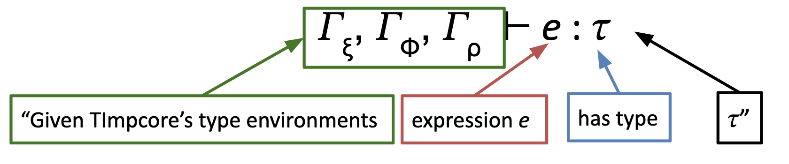

# Intro to Type Systems and Type Checkers

## Goals

- Constrain what values an expression can have at runtime
- Maintain types of defined names (a _typing environment_)

## Strategies

- Static
  - Determines the types of everything before the program is executed
  - More efficient at runtime
- Dynamic
  - Determines the types of things at runtime
  - More precise since we can look at the actual value of a variable. We don't need to guess.

## How to write a 105 Type System

1. Determine syntax for our types, and expressions and definitions using those types
2. Craft inference rules to prove if a type is valid
3. Craft inference rules to determine the valid type of an expression
4. Use inference rules to guide implementation of a type checker
5. Consider a language designer's process of adding new types to our system.

# Typed Impcore

Augmented Impcore with a _monomorphic type system_. Each type represents exactly one set of values. No generics or type variables.

(we'll do $\mu$Scheme with polymorphic types later)

## TImpcore Syntax

| Concrete Syntax (type constructor) | Abstract Syntax (IR)                          | Abstract Syntax (ML) |
| ---------------------------------- | --------------------------------------------- | -------------------- |
| `int`                              | `INT`                                         | see |
| `bool`                             | `BOOL`                                        | below |
| `unit`                             | `UNIT`                                        | for |
| $ty_1 ... ty_n$ `->` $ret\_ty$     | $\tau_1 \times ... \times \tau_n$ `->` $\tau$ | code |

```sml
datatype ty = INTTY
            | BOOLTY
            | UNITTY
datatype funty =
  FUNTY of ty list * ty
```

### For example we could write...

```lisp
-> (define unit f ([b : bool] [n : int]) (while b (+ n 1)))
f : (bool int -> unit)
```

- TImpcore **requires** that functions are typed. 
- It will infer types for global variables

## TImpcore Type Formation Rules


# Typing Rules and Type Checking Expressions

## New Notation



Since TImpcore has three environments, we also need three typing environments, which map names to types. So we can use some syntactic sugar and it looks much nicer.


## Inference Rules


# Adding New Types to a Monomorphic Language

## Questions for the Lanugage Designer:

1. What is the new type, and what does it look like?
2. How do you create new values of that type?
3. How do you use/observe values of that type?

In a monomorphic type system, answering each question requires two steps:

1. Crafting new syntax
2. Writing new inference rules for that syntax

## Adding function types to TImpcore

### The type and its shape

- **Concrete:** $ty_1 ... ty_n$ `->` $ret_{ty}$
- **Abstract:** $\tau_1 \times ... \times \tau_n \rightarrow \tau$
- **ML:** `datatype funty = FUNTY of ty list * ty`
- **Inference Rule:**


### Creating New Values

Let's use `lambda`!

- **Concrete:** `(lambda ([`$x_1$ `:` $ty_1$`]` $...$ `[`$x_n$ `:` $ty_n$`])` $e$`)`
- **Abstract:** $\text{LAMBDA}(\langle x_1 : \tau_1, ..., x_n : \tau_n \rangle, e)$
- **ML:** `| LAMBDA of (name * ty) list * exp`
- **Inference Rule:**


### Observing Values

Function application!

- **Concrete:** `(`$e$ $e_1$ $...$ $e_n$`)`
- **Abstract:** $\text{APPLY}(e, e_1, ..., e_n)$
- **ML:** `| APPLY of exp * exp list`
- **Inference Rule:**


