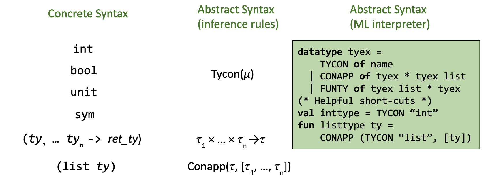
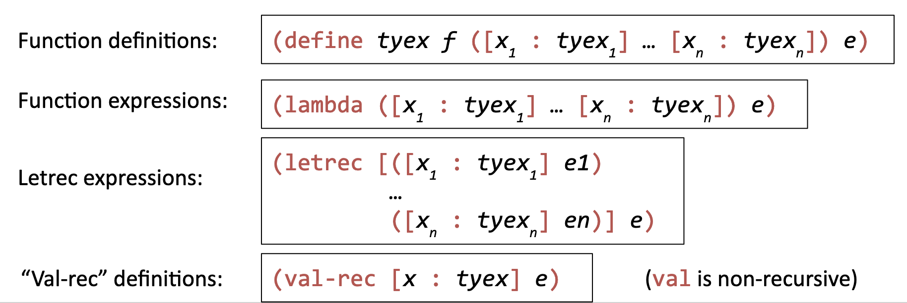
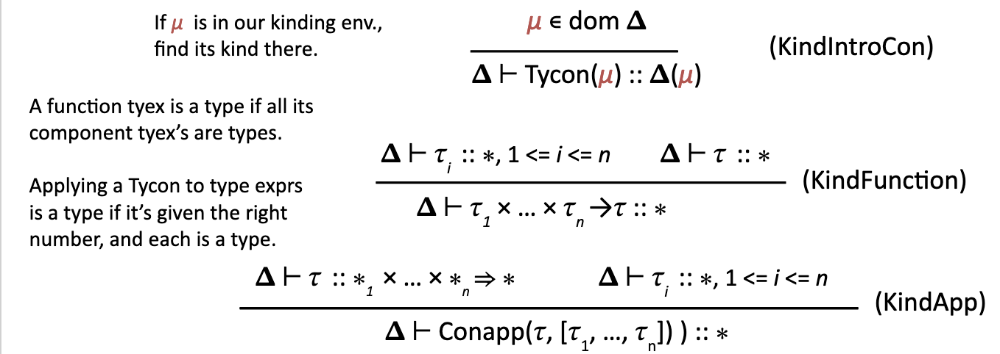
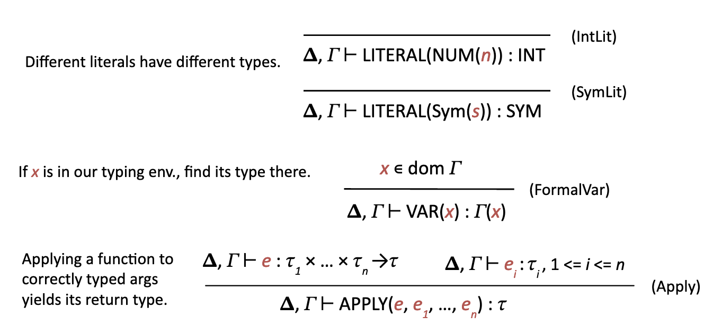

# Motivation

- Adding new types is really annoying in a monomorphic type system
- Can't express things like generics or containers elegantly
  
Polymorphism lets us abstract over types and get more powerful code.

# Typed $\mu$Scheme: Monomorphic

## Syntax

`Tycon(`$\mu$`)` and `Conapp(`$\tau$, `[`$\tau_1, ..., \tau_n$`])`helps us do some more modularity

## Where can we put types?

Anywhere a new name is introduced to the environment

# Kinding Rules: Upgrading Type Formation

In tImpcore, we had one type formation rule for each distinct type. Whenever we wanted to add a type we needed to specify a new rule.

Intead, we will use one set of rules that describe any type expression. Any type can be formed with a Tycon, $\tau_1, \times ...$ thingy, or Conapp. We need some way of evaluating syntactically correct type expressions and determining if they are semantically valid.

## Syntax of expressiong semantically valid types

English | Math
---|---
`int` is a type | `int :: *`
`bool` is a type | `bool :: *`
`unit` is a type | `unit :: *`
`sym` is a type | `sym :: *`
`list`, if given a type, produces a type | `list :: * => *`
`tuple`, if given two types, produces a type | `tuple :: *` $\times$ `* => *`

The things on the right signify _kinds_. There are two flavors:

1. `*` labels a type
2. `*` $\times ... \times$ `* => *` labels a "type in waiting"

## Writing Kinding Rules

We want a system that figures out the kind of any type expression. A type expression is "valid" if it has kind `*`.

We will use a _kind environment_ that maps type constructors to kinds. We'll call it $\Delta$.

$\Delta_{\text{initial}}$ looks like `{int::*, bool::*, unit::*, sym::*, list::*=>*}`

And we are going to use a _kinding judgement_ to state the kind of our type:

$$\Delta \vdash \tau::\kappa$$

## Our Kinding Rules

# Some Typing Rules for (Monomorphic) $\mu$Scheme

## Hey look some typing rules

# Adding Polymorphic Types to $\mu$Scheme
 